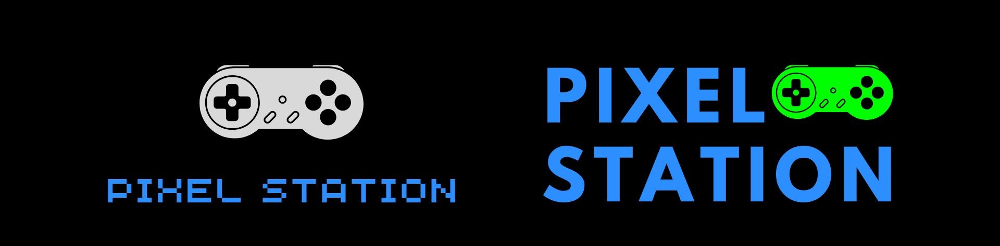

 
# Intro of the Project 

Welcome to Pixel Station – Your Retro Gaming Community! Are you a fan of the classics, the pixelated wonders that fueled our gaming passion in the golden era of video games? Look no further! Pixel Station is your dedicated online space to relive, share, and celebrate the magic of retro gaming.

Embark on a journey down memory lane as we bring together a community of passionate gamers who cherish the timeless appeal of vintage titles. Whether you're a Millennials player and Gen Z player or Generation Alpha curious about the gaming roots, Pixel Station is the place where gaming history comes to life.

Users can share their latest and most unique experiences through posts, as well as interact with each other through like, comment, and follow functionalities. This is the frontend repository [HERE](https://github.com/solracnauj92/pixelstationp5) of the React-powered Pixel Station project. The backend repository of the project can be accessed [HERE](https://github.com/solracnauj92/drf-api).

[Deployed Site](https://pixelstation-34f23d2cc74d.herokuapp.com/)


----

# [PIXELSTATION FrontEnd](https://pixelstationproject5-17ab85818140.herokuapp.com/)
# [PIXELSTATION FrontEnd Repo](https://github.com/solracnauj92/pixelstationproject5)
# [PIXELSTATION API](https://pixelstationproject5-api-1a9dadf46f0b.herokuapp.com)
# [PIXELSTATION API Repo](https://github.com/solracnauj92/pixelstation-api/tree/main)

[](https://github.com/solracnauj92/pixelstation-api/commits/main)
[](https://github.com/solracnauj92/pixelstation-api/commits/main)


Welcome to Pixelstation, a frontend service for [Pixelstation FrontEnd React](https://pixelstationproject5-17ab85818140.herokuapp.com/).

# Buisness Model 
## Aim of the Website

Pixiel Station is a vibrant community platform designed for gamers, particularly those passionate about retro games, as well as those curious to explore this unique genre or stay informed about the latest releases. The site offers a rich set of features, including interactive posts, community-driven forums, debate hubs, a monthly themed forum, and a game library, making it a go-to spot for gaming enthusiasts.


## Key Findings from User Research

At the beginning of the Pixel Station project, conducting thorough research was essential, even though this project mainly focuses on backend development. Understanding the target audience and the types of users I aim to attract helped shape the overall feel of the website, ensuring that the correct Django apps are implemented to meet user needs.

### Target Audience


Pixel Station caters to a diverse group of gaming enthusiasts:

1. **Retro Gamers (30-50):**
   - Nostalgic for classics like Super Mario Bros.
   - Enthusiastic about discussing gaming evolution.

2. **Content Creators (20-35):**
   - Streamers and YouTubers focusing on retro gaming.
   - Seeking a collaborative community.

3. **Casual Gamers (18-30):**
   - Curious about the origins of gaming.
   - Open to discovering vintage titles.

4. **Parent-Educators (30-50):**
   - Parents introducing kids to childhood games.
   - Educators incorporating retro games into teaching.

5. **Generation Alpha (5-15):**
   - Kids and teens curious about gaming history.
   - Introduced to classic games by family.

6. **Collectors and Historians (All Ages):**
   - Collectors of retro gaming items.
   - Engaging in discussions about gaming eras.

### User Personas

1. **As a Classic Gamer:**
   - I want to browse and join discussions about my favorite classic games to connect with like-minded enthusiasts.

2. **As a Retro Streamer:**
   - I want to share my retro gaming experiences, collaborate with fellow creators, and grow my audience within the Pixel Station community.

3. **As a Casual Explorer:**
   - I want to discover and learn about vintage games, understanding their impact on the gaming industry.

4. **As a Gaming Parent:**
   - I want to find recommendations for classic games suitable for my child's age and interests, fostering a shared gaming experience.

5. **As a Teacher:**
   - I want to access resources that help integrate retro gaming into my teaching methods, making learning more engaging for my students.

6. **As a Generation Alpha Gamer:**
   - I want to explore the history of gaming, play classic games, and connect with other young gamers who share similar interests.

7. **As a Retro Collector:**
   - I want to showcase my collection, discuss rare finds, and connect with other collectors to exchange tips and experiences.

8. **As a Historian:**
   - I want to contribute to discussions about the historical significance of different gaming eras and share my knowledge with the community.

### Testimonials generated 

1. **Johnny - Retro Gamer (Age: 38):**
   > "Pixel Station has reignited my love for classic games! Connecting with fellow enthusiasts in the community has been a blast. The discussions about gaming evolution take me on a trip down memory lane. This platform truly captures the essence of retro gaming."

2. **Sam- Casual Explorer (Age: 25):**
   > "Being a casual gamer, I was curious about vintage titles, and Pixel Station has been the perfect guide! I've discovered hidden gems and learned so much about the origins of gaming. The community is welcoming, making my exploration of retro games even more enjoyable."

3. **Amy - Retro Streamer (Age: 32):**
   > "Pixel Station is a haven for content creators like me! Sharing my retro gaming experiences with a collaborative community has been fantastic. The support and engagement from viewers within the Pixel Station community have significantly boosted my channel. It's more than just a platform; it's a retro gaming family!"


---

## Key Features

- **Interactive Posts**: Users can create, share, and comment on posts related to gaming news, personal experiences, and game discussions.
- **Community-Driven Forums**: A central hub where gamers can discuss various topics, share recommendations, and engage in debates.
- **Debate Hubs**: A specialized section for users to participate in debates on game-related topics, with voting and ranking features.
- **Monthly Themed Forum**: A rotating theme for each month, focused on specific gaming genres, game reviews, or community challenges.
- **Game Library**: A catalog of retro and modern games, with detailed pages featuring reviews, gameplay information, and user ratings.

## User Goals

- **Gamers**: Access and engage in discussions, share experiences, and discover new retro and modern games.
- **Casual Visitors**: Explore the site to learn more about retro gaming or check out the latest news and releases.
- **Community Enthusiasts**: Participate in themed forums, debates, and actively contribute to the platform's content.

## Site Admin Goals

As an administrator, Pixiel Station should be easily manageable and provide the following:
- **Content Moderation**: Tools to manage posts, comments, and user-generated content, ensuring a healthy community atmosphere.
- **User Management**: Admin should be able to view and manage user accounts, enforce community rules, and address reports or violations.
- **Customizable Features**: Easily editable themed forum sections and content to match monthly themes, and ability to highlight specific games or topics.

---
## Visitor Types

### First-Time Visitors

When a user visits **Pixiel Station** for the first time, they will be introduced to the core features of the platform, including:
- **Home Page**: A welcoming overview of the site with a brief description of what Pixiel Station is. Post page of the latest post and community comments,.etc. 
- **Sign-Up Prompt**: An encouragement to create an account for personalised features such as saving favorite games, following forums, and interacting with posts.

After their first visit, they will be invited to engage with content, join discussions, and explore the community further.

### Second-Time Visitors

For **second-time visitors**, the platform will focus on:
- **Active Community**: They will be encouraged to dive deeper into forum threads, participate in debates, or explore new game releases in the library.
- **Monthly Themed Forum**: The active theme for the month will be highlighted to invite them to join the latest community activities.
- **Profile Management**: The option to update their profile, track game ratings, and monitor their engagement with various discussions across the platform.

### Frequent Visitors

**Frequent visitors** will enjoy a fully personalized experience:
- **Discussion Engagement**: They will be able to join ongoing debates, comment on posts, and share their experiences with other community members.
- **Game Library Updates**: A regularly updated library with newly added retro games or upcoming releases, personalized to their preferences.
- **Profile Management**: The option to update their profile, track game ratings, and monitor their engagement with various discussions across the platform.

## Target Audience

Pixiel Station is designed to appeal to a variety of gaming enthusiasts. The key target audiences for the platform include:

- **Retro Gamers**: Individuals who are passionate about classic video games and nostalgic gaming experiences. They enjoy exploring older game titles and reliving the gaming culture of past decades.

- **Modern Gamers**: Gamers who are more focused on current and upcoming video game releases, including those who are curious about exploring retro games as well.

- **Curious Explorers**: People who may not be familiar with retro games but are intrigued to learn more about the genre. This group may include younger generations or new players wanting to expand their gaming interests.

- **Community-Oriented Gamers**: Enthusiasts who want to connect with other gamers, share experiences, and engage in meaningful conversations. They are likely to participate in forums, debates, and themed discussions.

- **Game Reviewers and Content Creators**: Individuals who enjoy reviewing games, sharing opinions, or creating content like blogs, videos, or podcasts. They may use Pixiel Station to share their thoughts on retro and modern games.

- **Casual Gamers**: Those who play games occasionally and are looking for a platform to discover new games, participate in community activities, or stay informed about the latest gaming trends.

- **Competitive Gamers and Debaters**: Gamers who enjoy engaging in lively debates, discussions, and rankings related to gaming, whether it's about game mechanics, industry trends, or the best titles in any given genre.

- **Collectors and Curators**: People who collect retro games or memorabilia, and want to interact with other like-minded collectors or learn about rare and valuable items within the gaming community.

- **Game Developers and Designers**: Individuals or teams who develop or design games and want to be part of a community that shares insights, feedback, and engages in discussions on game development trends.

- **Event Participants**: Gamers who are interested in participating in site-wide events often hosted on the platform.

Pixiel Station provides a platform that serves all of these audiences, creating a dynamic and engaging environment for gamers of every type.

---

# Branding 

## Logo:
 


The logo features a joystick, symbolising the retro gaming experience.

## Colours 
 


Research carefully and chosen the classic colours used for gaming.

## Fonts 
 - Arcader Gamer 
 - Hero 

## Profile Icons (Users)


---
# Testings

### Validations

Comprehensive testing has been conducted for all React JavaScript and CSS files in the Pixiel Station frontend. Screenshots document the results, indicating whether each file has errors or is error-free. Given the number of files involved, these screenshots are stored separately in the project repository for better organization.

You can view the testing screenshots in the following directory:
[Testing Images](https://github.com/solracnauj92/pixelstationproject5/tree/main/Documentation/testingimages)

Each screenshot provides a clear record of the testing status for individual files.

### JavaScript Validation

JavaScript validation was performed using [JSHint](https://jshint.com/). Screenshots capture the results of JSHint validation for each JavaScript file, showing any detected issues or confirming that the file is error-free. This validation process helps ensure high code quality by identifying potential issues and enforcing JavaScript best practices.

### CSS Validation

CSS validation was performed using the W3C CSS Validator to verify code quality across all stylesheets. Screenshots are included for each CSS file, showing validation results to confirm compliance or highlight any errors. This process ensures that the CSS is optimized and free from errors, contributing to a consistent and visually appealing user interface.

## Responsiveness 

# References 

The following resources were instrumental in gathering information, assets, and tools for building and enhancing Pixiel Station:

### Game Libraries and Content References

- [EA Games Library](https://www.ea.com/en-gb/games/library) – Used as a reference for popular game titles and content.
- [Steam Store](https://store.steampowered.com/) – Source for game descriptions, images, and metadata in the game library.
- [Nintendo What's New](https://www.nintendo.com/us/whatsnew/?srsltid=AfmBOopcrQhhNfaRDCK7YQZF1PlyIXzB4PqdN79x3_0neil7ehjSTI5h) – Source for the latest gaming news, images, and updates for keeping the site current.

### Event Listings

- [Royal Albert Hall – Final Fantasy VII Rebirth Orchestra World Tour](https://www.royalalberthall.com/tickets/events/2024/final-fantasy-vii-rebirth-orchestra-world-tour/) – Provided an example for event listings in the site’s newsletter.
- [Wikipedia: Final Fantasy](https://en.wikipedia.org/wiki/Final_Fantasy) and [Wikipedia: Music of the Final Fantasy Series](https://en.wikipedia.org/wiki/Music_of_the_Final_Fantasy_series) – References used in forum pages to provide accurate information about the Final Fantasy game series and its music.

### Development Tools and Documentation

- **React**:
  - [React Documentation](https://react.dev/) – Primary resource for implementing React in frontend development.
  - [React Installation Guide](https://react.dev/learn/installation) – Instructions for setting up React.
  - [Starting a New React Project](https://react.dev/learn/start-a-new-react-project) – Guidelines for initializing a React project.
  - [Legacy React Documentation](https://legacy.reactjs.org/) – Provided support for older React features and components.
  - [W3Schools React](https://www.w3schools.com/REACT/DEFAULT.ASP) – For foundational tutorials on React components and hooks.
  - [React Forms Tutorial (FreeCodeCamp YouTube)](https://www.youtube.com/watch?v=CT-72lTXdPg) – FreeCodeCamp tutorial for building simple and effective React forms.
  - [React Newsletter Signup Form (YouTube)](https://www.youtube.com/watch?v=gHFZur10nK4) – Tutorial for building a responsive newsletter signup form with React.
  - [React Complete Course Playlist (YouTube)](https://www.youtube.com/watch?v=DLX62G4lc44&list=PLWKjhJtqVAbkArDMazoARtNz1aMwNWmvC) – Comprehensive guide for learning React, covering essential components, state, and hooks.
- **Django and Backend Development**:
  - [Django REST Framework Documentation](https://www.django-rest-framework.org/) – Main documentation for implementing and managing Django REST APIs.
  - [Code Institute DRF API GitHub Repository](https://github.com/Code-Institute-Solutions/drf-api) – Backend source code reference.
  - [Code Institute Frontend GitHub Repository](https://github.com/Code-Institute-Solutions/moments) – Frontend code reference for project setup and best practices.
- **Bootstrap**:
  - [Bootstrap](https://getbootstrap.com/) – Used for creating responsive layouts and UI components.
  - [Bootstrap Brain](https://bootstrapbrain.com/) – Provided guidance on best practices for Bootstrap design.
  - [Bootstrap Icons](https://icons.getbootstrap.com/) – Source of icons for consistent visual design.
- **General Development Tools**:
  - [Dev Tools (Google Chrome)](https://developer.chrome.com/docs/devtools/) – Used for debugging, inspecting network requests, and performance analysis.
  - [Heroku Dev Center](https://devcenter.heroku.com/categories/reference) – Reference for deploying and managing the application on Heroku.
  - [NPM CLI Commands](https://docs.npmjs.com/cli/v10/commands/npm-start) – NPM commands for managing dependencies and running the project locally.
  - [React Infinite Scroll Component on npm](https://www.npmjs.com/package/react-infinite-scroll-component) – Used to implement infinite scrolling features.
  - [DifferChecker](https://www.differchecker.com/) – Tool for checking differences between code versions and ensuring consistency.
  - [Stack Overflow](https://stackoverflow.com/) – Provided solutions and advice for debugging and implementing React and JavaScript features.

### Tutorials and Guides

- [React Tutorial for Beginners (YouTube)](https://www.youtube.com/watch?v=SqcY0GlETPk&t=163s) – Video tutorial for building React components and managing state.
- **Code Institute Walkthrough Tutorials** – Video tutorials covering backend and frontend development that provided structure and guidance throughout the project.
- **ChatGPT** – Assisted with troubleshooting code errors, clarifying development concepts, and generating placeholder text for site content. ChatGPT also provided guidance on complex functionality.
### Design and Visual Assets

- [Dribbble - Profile Page Inspiration](https://dribbble.com/tags/profile-page) – Used for inspiration on profile page designs.
- [Canva](https://www.canva.com/) – Tool for creating images, logos, and other design assets for the site.


## PostgreSQL Database

This project uses a [Code Institute PostgreSQL Database](https://dbs.ci-dbs.net).

To obtain my own Postgres Database from Code Institute, I followed these steps:

- Signed-in to the CI LMS using my email address.
- An email was sent to me with my new Postgres Database.

> [!CAUTION]  
> - PostgreSQL databases by Code Institute are only available to CI Students.
> - You must acquire your own PostgreSQL database through some other method
> if you plan to clone/fork this repository.
> - Code Institute students are allowed a maximum of 8 databases.
> - Databases are subject to deletion after 18 months.

## Cloudinary API

This project uses the [Cloudinary API](https://cloudinary.com) to store media assets online, due to the fact that Heroku doesn't persist this type of data.

To obtain your own Cloudinary API key, create an account and log in.

- For *Primary interest*, you can choose *Programmable Media for image and video API*.
- Optional: *edit your assigned cloud name to something more memorable*.
- On your Cloudinary Dashboard, you can copy your **API Environment Variable**.
- Be sure to remove the `CLOUDINARY_URL=` as part of the API **value**; this is the **key**.

## Heroku Deployment

This project uses [Heroku](https://www.heroku.com), a platform as a service (PaaS) that enables developers to build, run, and operate applications entirely in the cloud.

Deployment steps are as follows, after account setup:

- Select **New** in the top-right corner of your Heroku Dashboard, and select **Create new app** from the dropdown menu.
- Your app name must be unique, and then choose a region closest to you (EU or USA), and finally, select **Create App**.
- From the new app **Settings**, click **Reveal Config Vars**, and set your environment variables.

> [!IMPORTANT]  
> This is a sample only; you would replace the values with your own if cloning/forking my repository.

| Key | Value |
| --- | --- |
| `CLOUDINARY_URL` | user's own value |
| `DATABASE_URL` | user's own value |
| `DISABLE_COLLECTSTATIC` | 1 (*this is temporary, and can be removed for the final deployment*) |
| `SECRET_KEY` | user's own value |

Heroku needs three additional files in order to deploy properly.

- requirements.txt
- Procfile
- runtime.txt

You can install this project's **requirements** (where applicable) using:

- `pip3 install -r requirements.txt`

If you have your own packages that have been installed, then the requirements file needs updated using:

- `pip3 freeze --local > requirements.txt`

The **Procfile** can be created with the following command:

- `echo web: gunicorn app_name.wsgi > Procfile`
- *replace **app_name** with the name of your primary Django app name; the folder where settings.py is located*

The **runtime.txt** file needs to know which Python version you're using:
1. type: `python3 --version` in the terminal.
2. in the **runtime.txt** file, add your Python version:
	- `python-3.9.19`

For Heroku deployment, follow these steps to connect your own GitHub repository to the newly created app:

Either:

- Select **Automatic Deployment** from the Heroku app.

Or:

- In the Terminal/CLI, connect to Heroku using this command: `heroku login -i`
- Set the remote for Heroku: `heroku git:remote -a app_name` (replace *app_name* with your app name)
- After performing the standard Git `add`, `commit`, and `push` to GitHub, you can now type:
	- `git push heroku main`

The project should now be connected and deployed to Heroku!

## Local Deployment

This project can be cloned or forked in order to make a local copy on your own system.

For either method, you will need to install any applicable packages found within the *requirements.txt* file.

- `pip3 install -r requirements.txt`.

You will need to create a new file called `env.py` at the root-level,
and include the same environment variables listed above from the Heroku deployment steps.

> [!IMPORTANT]  
> This is a sample only; you would replace the values with your own if cloning/forking my repository.

Sample `env.py` file:

```python
import os

os.environ.setdefault("CLOUDINARY_URL", "user's own value")
os.environ.setdefault("DATABASE_URL", "user's own value")
os.environ.setdefault("SECRET_KEY", "user's own value")

# local environment only (do not include these in production/deployment!)
os.environ.setdefault("DEBUG", "True")
```

Once the project is cloned or forked, in order to run it locally, you'll need to follow these steps:

- Start the Django app: `python3 manage.py runserver`
- Stop the app once it's loaded: `CTRL+C` or `⌘+C` (Mac)
- Make any necessary migrations: `python3 manage.py makemigrations`
- Migrate the data to the database: `python3 manage.py migrate`
- Create a superuser: `python3 manage.py createsuperuser`
- Load fixtures (if applicable): `python3 manage.py loaddata file-name.json` (repeat for each file)
- Everything should be ready now, so run the Django app again: `python3 manage.py runserver`

### Cloning

You can clone the repository by following these steps:

1. Go to the repository 
2. Locate the Code button above the list of files and click it 
3. Select if you prefer to clone using HTTPS, SSH, or GitHub CLI and click the copy button to copy the URL to your clipboard
4. Open Git Bash or Terminal
5. Change the current working directory to the one where you want the cloned directory
6. In your IDE Terminal, type the following command to clone my repository:
	git clone https://github.com/solracnauj92/
7. Press Enter to create your local clone.

Alternatively, if using Gitpod, you can click below to create your own workspace using this repository.


Please note that in order to directly open the project in Gitpod, you need to have the browser extension installed.
A tutorial on how to do that can be found [here](https://www.gitpod.io/docs/configure/user-settings/browser-extension).

### Forking

By forking the GitHub Repository, we make a copy of the original repository on our GitHub account to view and/or make changes without affecting the original owner's repository.
You can fork this repository by using the following steps:

1. Log in to GitHub and locate 
2. At the top of the Repository (not top of page) just above the "Settings" Button on the menu, locate the "Fork" Button.
3. Once clicked, you should now have a copy of the original repository in your own GitHub account!

## Credits

I would like to extend my heartfelt gratitude to the following individuals and team who supported me throughout this project:

- **Code Institute Tutors**: For their continuous guidance and assistance during the first walkthrough of both the API setup and front-end development. Your expertise has been invaluable.
- **My Wife**: For her unwavering support and patience during this journey, especially during difficult times. Thank you for always being there for me.
- **My NHS Workplace Manager**: For understanding my situation and providing flexibility in my work schedule. This allowed me to balance a full-time job and study time effectively.
- **Other Supportive Individuals**: 
    - Family and friends who offered encouragement.
    - The community resources available through forums and tutorials that helped me solve challenges.


